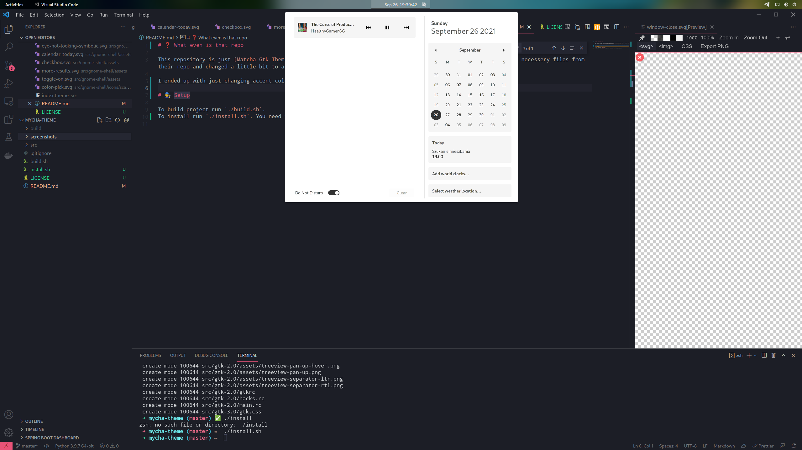
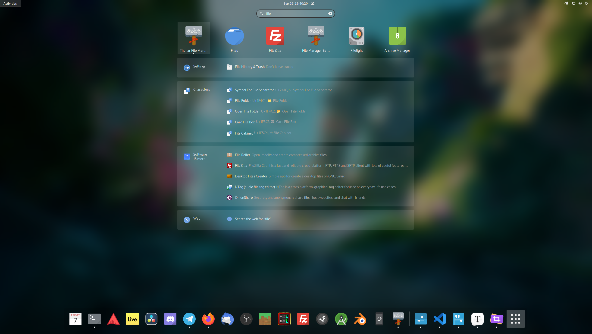
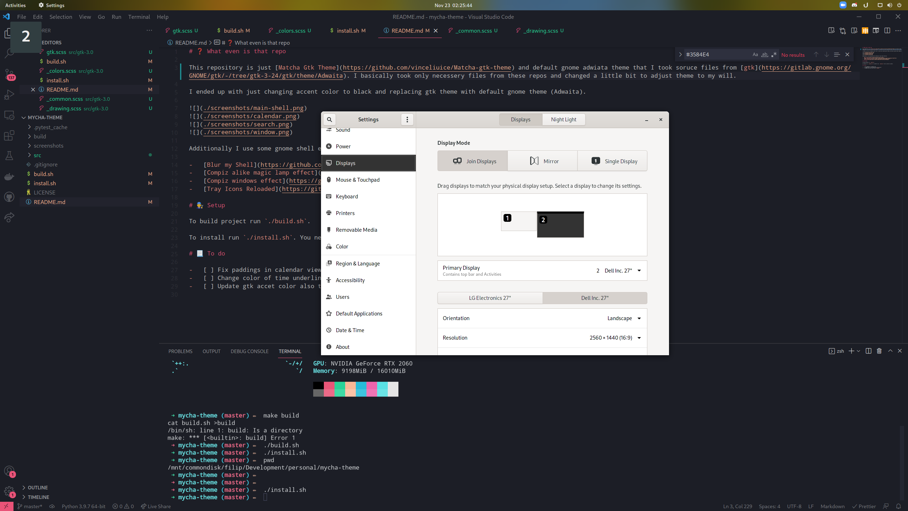

# ❓ What even is that repo

This repository is just [Matcha Gtk Theme](https://github.com/vinceliuice/Matcha-gtk-theme). I basically took only necessery files from their repo and changed a little bit to adjust theme to my will.

I ended up with just changing accent color to black and replacing gtk theme with default gnome theme (Adwaita).

Additionally I use some gnome shell extensions to get look like this:

-   [Blur my Shell](https://github.com/aunetx/blur-my-shell)
-   [Compiz alike magic lamp effect](https://github.com/hermes83/compiz-alike-magic-lamp-effect)
-   [Compiz windows effect](https://github.com/hermes83/compiz-windows-effect)
-   [Tray Icons Reloaded](https://github.com/MartinPL/Tray-Icons-Reloaded)

# 👨‍🔧 Setup

To build project run `./build.sh`.

To install run `./install.sh`. You need to run `./build.sh` first in order to install.

# 📃 To do

-   [ ] Fix paddings in calendar view
-   [ ] Change color of time underline at the top bar
-   [ ] Update gtk accet color also to `#333333`
